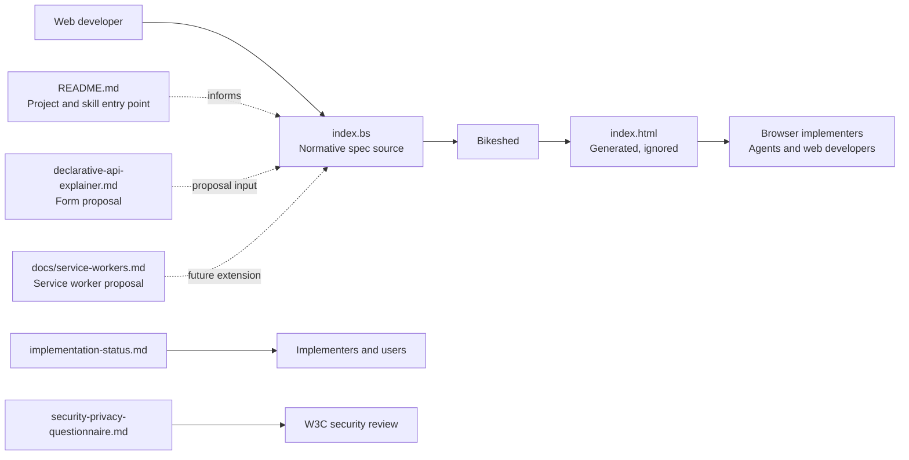
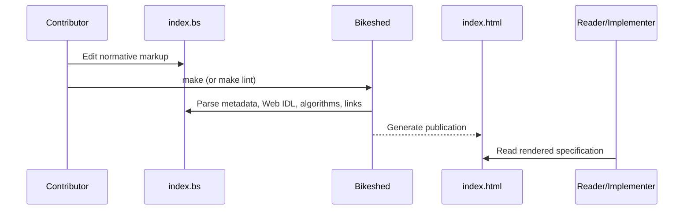
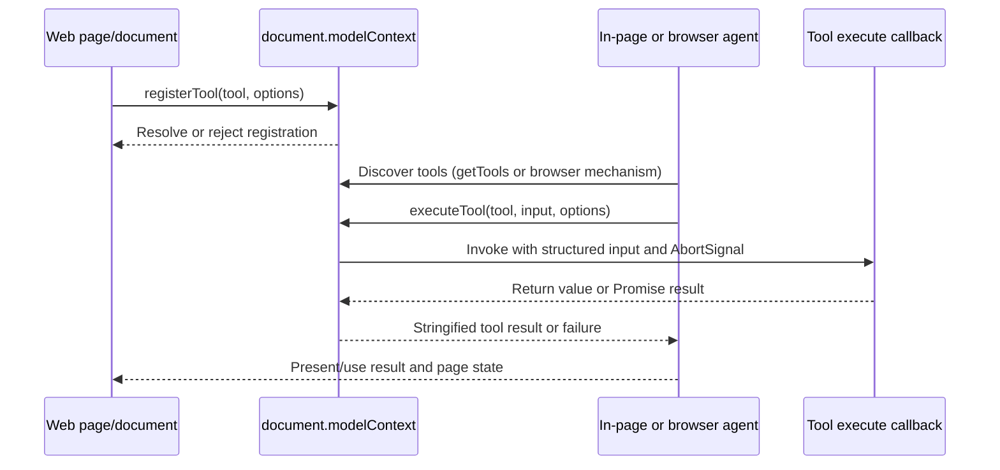
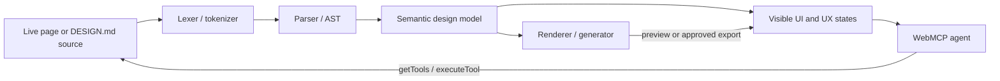

# Architecture Overview

## System Summary

WebMCP is a W3C Web Machine Learning Community Group specification repository. It defines a browser API that lets web applications expose client-side JavaScript functions and, in an associated proposal, HTML forms as structured tools for AI agents. The repository is a document/specification project, not a deployable web application: it has no application server, database, frontend build, or runtime service layer.

The main deliverable is the Bikeshed-generated WebMCP specification. Supporting Markdown documents explain the motivation, implementation status, security/privacy review, declarative API proposal, and a possible service-worker extension.

**Tech stack and tooling:**

- Specification source: Bikeshed markup in [`index.bs`](index.bs)
- Generated publication: `index.html` (ignored by Git)
- Build/lint/watch: [`Makefile`](Makefile)
- Metadata: [`w3c.json`](w3c.json)
- Documentation: Markdown
- Runtime dependencies: none declared in this repository
- Tests: no repository-local test suite; the spec metadata points to the Web Platform Tests results for WebMCP

## High-Level Architecture



The source document describes the API and processing model. Bikeshed resolves Web Platform references, renders Web IDL and algorithms, generates navigation/cross-references, and emits the publication. The other documents are deliberately separate: they provide context or proposals and are not application modules imported by `index.bs`.

## Project Structure

```text
.
├── index.bs                         # Normative Bikeshed specification source
├── Makefile                         # Generate, lint, and watch commands
├── w3c.json                         # W3C repository metadata
├── README.md                        # webmcp-agents project entry point
├── implementation-status.md         # Browser/product implementation status
├── declarative-api-explainer.md     # HTML form-based tool proposal
├── docs/
│   ├── service-workers.md            # Service-worker-based extension proposal
│   └── webmcp-explainer.md           # WebMCP motivation and API explainer
├── security-privacy-questionnaire.md# W3C security/privacy self-review
├── CONTRIBUTING.md                  # W3C contribution and contributor rules
├── LICENSE.md                       # W3C software and document license
├── .codex/skills/                    # Curated skills; see catalog.md
│   └── catalog.md                    # Canonical ownership inventory
├── scripts/                          # Maintainer validation helpers
│   └── validate-skills.sh            # Skill/catalog/boundary checks
└── assets/                          # Repository branding assets
```

## Unified Skill Surface

The repo-local skill suite is indexed by [`.codex/skills/catalog.md`](.codex/skills/catalog.md), which is the single source of truth for skill ownership and repository coverage.

Direct skill entry points: [core](.codex/skills/webmcp-core/SKILL.md), [agent-browser](.codex/skills/webmcp-agent-browser/SKILL.md), [tool-design](.codex/skills/webmcp-tool-design/SKILL.md), [design-md](.codex/skills/webmcp-design-md/SKILL.md), [declarative](.codex/skills/webmcp-declarative/SKILL.md), [service-workers](.codex/skills/webmcp-service-workers/SKILL.md), [security](.codex/skills/webmcp-security/SKILL.md), [evals](.codex/skills/webmcp-evals/SKILL.md), [frameworks](.codex/skills/webmcp-frameworks/SKILL.md), [setup](.codex/skills/webmcp-setup/SKILL.md), and [maintainer](.codex/skills/webmcp-maintainer/SKILL.md).

Load the smallest skill matching the task, then follow its source links. [`scripts/validate-skills.sh`](scripts/validate-skills.sh) is the executable stale/orphan and boundary check.

## Key Components

### Normative specification (`index.bs`)

`index.bs` is the single source of truth for the current draft specification. Its major sections are:

- Introduction and terminology for agents, browser agents, and AI platforms.
- Supporting concepts such as model contexts, tool definitions, annotations, and pending executions.
- The `Document.modelContext` extension and `ModelContext` interface.
- Imperative tool registration, discovery, execution, cancellation, and dynamic updates.
- Declarative WebMCP, permissions policy integration, and interaction with agents.
- Security/privacy risks, mitigations, accessibility considerations, and acknowledgements.

The API surface is centered on `document.modelContext`:

```webidl
[Exposed=Window, SecureContext]
interface ModelContext : EventTarget {
  Promise<undefined> registerTool(ModelContextTool tool, optional ModelContextRegisterToolOptions options = {});
  Promise<sequence<RegisteredTool>> getTools(optional ModelContextGetToolOptions options = {});
  Promise<DOMString> executeTool(RegisteredTool tool, optional object inputObject = {}, optional ModelContextExecuteToolOptions options = {});
  attribute EventHandler ontoolchange;
};
```

Tools carry a name, optional title, description, JSON-schema-like input metadata, an execute callback, annotations, and exposure rules. The specification tracks pending executions across documents/navigables and integrates cancellation through `AbortSignal`.

### Supporting documents

- [`README.md`](README.md) is the `webmcp-agents` project entry point and skill guide.
- [`docs/webmcp-explainer.md`](docs/webmcp-explainer.md) explains WebMCP motivation, goals/non-goals, use cases, lifecycle, alternatives, prior art, and open questions in developer-facing language.
- [`declarative-api-explainer.md`](declarative-api-explainer.md) proposes exposing forms through `toolname`, `tooldescription`, `toolautosubmit`, and `toolparamdescription`, plus response and activation behavior. It contains explicit TBD areas.
- [`docs/service-workers.md`](docs/service-workers.md) explores installing and routing tools through service workers, including multi-tab routing, session IDs, and security tradeoffs. It is an explainer, not part of the current normative API surface.
- [`implementation-status.md`](implementation-status.md) records reported support/status for Brave, ChatGPT Desktop, Chrome, Edge, Firefox, and Safari.
- [`security-privacy-questionnaire.md`](security-privacy-questionnaire.md) answers the W3C self-review questionnaire and links to the normative security/privacy section.
- [`.codex/skills/webmcp-design-md/SKILL.md`](.codex/skills/webmcp-design-md/SKILL.md) connects the external alpha DESIGN.md format to WebMCP page tools through a Lexer → Parser/AST → semantic resolution → Renderer pipeline; it does not extend the normative API.
- [`CONTRIBUTING.md`](CONTRIBUTING.md) documents W3C Community Group membership and contributor attribution rules.

## Data and Control Flow

### Editing and publication flow



If a local `bikeshed` executable exists, `make` runs `bikeshed spec`; otherwise the Makefile uploads `index.bs` to the CSSWG Bikeshed API. `index.html` is ignored in [`.gitignore`](.gitignore), so the generated artifact is local/build output rather than source-controlled architecture.

### Tool registration and invocation flow



The browser mediates discovery and execution. Tools remain associated with their document lifetime; cross-document exposure is constrained by secure-context and `tools` Permissions Policy rules, with `exposedTo` controlling explicitly exposed origins.

### DESIGN.md authoring flow



This is an authoring and tool-orchestration pattern, not additional WebMCP standard surface. WebMCP supplies the page-local discovery and execution boundary; the document pipeline supplies the design artifact and diagnostics.

## Common Patterns

### Imperative tool registration

Web developers reuse existing page logic by registering a named callback with a natural-language description and structured input schema:

```js
await document.modelContext.registerTool({
  name: "search-cars",
  description: "Perform a car make/model search",
  inputSchema: {
    type: "object",
    properties: {
      make: { type: "string" },
      model: { type: "string" }
    },
    required: ["make", "model"]
  },
  async execute({ make, model }, { signal }) {
    return searchCars(make, model, signal);
  }
});
```

The example is illustrative; the authoritative Web IDL, validation rules, algorithms, and terminology live in `index.bs`.

### Declarative form exposure

The form proposal maps existing semantic HTML into a tool declaration. Its schema synthesis, response handling, pseudo-classes, and event behavior remain proposal material and should be treated as unstable until incorporated into the normative specification.

### Document-scoped state with browser-level execution tracking

The spec keeps a tool map and local pending execution map in each `ModelContext`, while a traversable navigable owns the broader pending execution map needed to coordinate work across document event loops and navigation/BFCache behavior.

## How To Guides

### Modify the normative API

1. Edit [`index.bs`](index.bs), in the relevant section under the API or processing model.
2. Update related algorithms, Web IDL, definitions, examples, and security/privacy text in the same change when behavior changes.
3. Run `make` to render the document, or `make lint` for Bikeshed diagnostics when local Bikeshed is installed.
4. Review generated cross-references and warnings; do not commit `index.html` unless repository policy changes.
5. Update [`README.md`](README.md), [`docs/webmcp-explainer.md`](docs/webmcp-explainer.md), [`implementation-status.md`](implementation-status.md), or another explainer only when the user-facing explanation or implementation status also changed.

### Add or revise a proposal/explainer

Use `README.md` for `webmcp-agents` project guidance, `docs/webmcp-explainer.md` for broad WebMCP motivation and developer-facing explanations, `declarative-api-explainer.md` for form-based API ideas, and `docs/service-workers.md` for service-worker architecture. Mark unresolved behavior as proposal/TBD text and link the relevant issue rather than presenting it as normative behavior.

### Check implementation support

Edit [`implementation-status.md`](implementation-status.md). Keep browser/product claims scoped to the evidence and link to implementation or tracking sources where available. This file is informational and does not alter the API definition.

### Update security or privacy review

1. Update the relevant normative section in [`index.bs`](index.bs) if the specification's threat model or mitigation changes.
2. Update [`security-privacy-questionnaire.md`](security-privacy-questionnaire.md) so the self-review remains consistent.
3. Check permissions policy, origin exposure, high-privilege actions, prompt/output injection, over-parameterization, and cross-origin boundary implications.

### Change build behavior

Edit [`Makefile`](Makefile). Preserve the existing two paths: local Bikeshed for normal development and the CSSWG API fallback when Bikeshed is not installed. Update comments and this document if targets or generated-file policy change.

## Key Files Reference

| File | Purpose | Modify for |
| --- | --- | --- |
| [`index.bs`](index.bs) | Normative Bikeshed specification | API behavior, algorithms, Web IDL, security/privacy requirements |
| [`Makefile`](Makefile) | Build, lint, and watch commands | Publication workflow or tool invocation |
| [`w3c.json`](w3c.json) | W3C repository metadata | Group, contact, or repository type metadata |
| [`README.md`](README.md) | Project README and skill entry point | Skill usage, project boundaries, source authority |
| [`docs/webmcp-explainer.md`](docs/webmcp-explainer.md) | Main WebMCP explainer and examples | Motivation, use cases, API lifecycle, open questions |
| [`declarative-api-explainer.md`](declarative-api-explainer.md) | Form-based proposal | Declarative API exploration |
| [`docs/service-workers.md`](docs/service-workers.md) | Service-worker proposal | Background/service-worker architecture exploration |
| [`implementation-status.md`](implementation-status.md) | Support tracking | Browser/product status |
| [`security-privacy-questionnaire.md`](security-privacy-questionnaire.md) | W3C self-review | Security/privacy questionnaire answers |
| [`CONTRIBUTING.md`](CONTRIBUTING.md) | Contribution rules | Contributor process |
| [`LICENSE.md`](LICENSE.md) | Repository license notice | License text or link |
| `.gitignore` | Generated-file policy | Ignore rules such as `index.html` |

## Dependencies and External References

The repository has no package manifest or declared runtime dependencies. Its meaningful dependencies are document-tooling and standards references:

- Bikeshed, used to render and lint `index.bs`.
- W3C/WHATWG Web IDL and HTML definitions referenced from the spec.
- JSON Schema references for tool input schemas.
- Permissions Policy and Secure Contexts references for access control.
- MCP, used as an architectural comparison for in-page tools.
- Web Platform Tests results, linked from the spec metadata as the intended test-results surface.

## Development Workflow

```text
Edit index.bs or an explainer
        ↓
make lint          (when local Bikeshed is installed)
        ↓
make               (render index.html)
        ↓
Review warnings, generated output, links, and wording
        ↓
Submit contribution under W3C CG rules
```

Useful commands:

- `make` — generate `index.html`; uses local Bikeshed when available, otherwise the CSSWG API.
- `make lint` — run Bikeshed's dry-run diagnostics; only defined when local Bikeshed is installed.
- `make watch` — regenerate while editing; only defined when local Bikeshed is installed.

## Troubleshooting

**`make lint` or `make watch` is unavailable**

Those targets are conditionally defined only when `bikeshed` is on `PATH`. Install/use local Bikeshed, or use the default `make` target, which falls back to the CSSWG Bikeshed API.

**Generated `index.html` is missing or stale**

Run `make`. The file is intentionally ignored, so check the generated output locally rather than expecting it in `git status`.

**Bikeshed reports an undefined reference or warning**

Inspect the referenced definition in `index.bs`, its `<pre class="anchors">` mappings, and the exact external spec anchor. Run the dry-run lint command and fix the source warning before relying on the generated document.

**A proposal conflicts with the normative spec**

Treat `index.bs` as authoritative. Label the Markdown material as exploratory/TBD and reconcile the documents in the same change if the proposal becomes normative.

## Scope and Known Boundaries

- This repository specifies browser behavior; it does not implement a browser, agent, MCP server, or service worker.
- The service-worker and declarative-form designs are exploratory and include unresolved routing/schema/response questions.
- Browser support is tracked separately and may change independently of the draft text.
- No local automated conformance suite is present; verification relies on Bikeshed diagnostics and external Web Platform Tests/implementation tracking.
